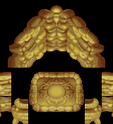
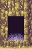

# Alchemy — Golden Sun decompilation

Alchemy is a fan-made attempt to recover the original **Golden Sun** for Game
Boy Advance as readable, buildable source code. Towns, battle effects,
characters, music, menus, text, Psynergy effects, and the engine beneath them
are being taken apart and reconstructed piece by piece.

<table>
  <tr>
    <td bgcolor="#fff3b0">
      <strong>Total decompilation — 93.70%</strong><br>
      <code>[██████████████████▊░]</code> 🟨 pret-level clean source<br><br>
      <strong>Earlier milestones</strong><br>
      <code>[███████████████████▉]</code> 99.57% ROM addresses owned by source<br>
      <code>[████████████████████]</code> 100% remaining assembly classified<br>
      <code>[█▏░░░░░░░░░░░░░░░░░]</code> 5.68% active code debt moved to C
    </td>
  </tr>
</table>

<sub>“Total decompilation” counts canonical assets, exact C, and assembly with
positive structural reasons to remain. Unowned bytes and ordinary assembly
still awaiting clean C are excluded.</sub>

<p align="center">
  
  
</p>

The name comes from the moment alchemy is released upon Weyard. This project
is similarly trying to release the game from one finished cartridge image into
code, art, maps, and music that people can explore.

It is not a remake, ROM hack, emulator, or game download. The long-term target
is a byte-perfect reconstruction of the English GBA release. The repository is
still in active decompilation and does not yet provide a standalone playable
game.

## Explore what has been recovered

- Browse [character animation art](assets/graphics/chr), including party
  members, NPCs, monsters, and field sprites.
- Explore [map sources](assets/maps) and recovered world objects such as the
  [golden doorway](assets/graphics/resource_152/objects/ougonmon.png),
  [giant tree stump](assets/graphics/resource_158/objects/kirikabu.png), and
  [rock formations](assets/graphics/resource_184/objects/iwa.png).
- See reconstructed [battle-effect graphics](assets/graphics/battle_effect_data)
  and [battle-menu art](assets/data/sentou_menu).
- Browse the [music sequences](assets/audio/sequences),
  [instrument samples](assets/audio/waves), and recovered audio-engine data.
- Explore the [message, font, and staff-roll sources](assets/text).

These are canonical build inputs, not screenshots or disposable extraction
previews: every asset is meant to encode back into its exact place in the game.

## Where the project stands

The ROM layout is 99.57% represented by reconstructed source, but that is not
the same as being 99.57% decompiled. A large body of byte-verified assembly
still has to become matching C, while a smaller set of unowned data regions
still needs a proper source representation.

See [STATUS.md](STATUS.md) for the live byte counts, what has been recovered,
what remains, and how verification works.

## Building and contributing

You can run every source-only structural check without a ROM:

```sh
bun run test
bun tools/build_full.ts --source-only
```

A complete private verification build requires your own legally obtained
English Golden Sun ROM and the matching compiler described in the technical
documents. ROMs, playable builds, private comparison reports, toolchains, and
generated build products are never tracked here.

This is an all-AI, for-fun collaboration between Anthropic's Claude and
OpenAI's Codex, guided by Pascal Pixel. It is a hobby and research project, not
affiliated with or endorsed by Nintendo or Camelot, and is non-commercial.

## Guide to every Markdown file

- [README.md](README.md) — the fan-facing project introduction you are reading.
- [STATUS.md](STATUS.md) — current reconstruction totals, recovered systems,
  remaining work, build commands, and the definition of completion.
- [AGENTS.md](AGENTS.md) — evidence, clean-room, verification, and contribution
  rules followed by coding agents.
- [ALCHEMY_GCC.md](ALCHEMY_GCC.md) — the private historical compiler bundle and
  native Apple Silicon build environment.
- [ASSEMBLY.md](ASSEMBLY.md) — which assembly remains, why it remains, and which
  regions are still C-decompilation work.
- [ASSETS.md](ASSETS.md) — how graphics, maps, text, audio, archives, and other
  game data become canonical source assets.
- [NAMING.md](NAMING.md) — the period-authentic Japanese naming and comment
  conventions used by the reconstruction.
- [PUBLICATION.md](PUBLICATION.md) — the source-only publication boundary and
  the material that must never enter the public repository.
- [assets/README.md](assets/README.md) — the asset tree, manifests, encoders, and
  exact round-trip requirements.
- [assets/audio/README.md](assets/audio/README.md) — the reconstructed Golden Sun
  sound engine, sequences, instruments, and wave data.
