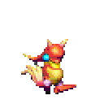

# Alchemy — Golden Sun decompilation

  
  
  
  

An all-AI, for-fun attempt at decompiling Golden Sun (GBA). The reconstruction
and tooling in this repository are being written collaboratively with AI coding
agents—Anthropic's Claude and OpenAI's Codex—as an experiment in how far they
can take a clean-room decompilation together. It is a hobby/research project,
not a serious or community-driven decomp, and it is nowhere near complete.

A clean-room, in-progress decompilation of Golden Sun (GBA), reconstructed
from privately supplied regional ROMs using only generic tools. The English
Golden Sun ROM is the sole byte-identical build target; the other approved
regional ROMs are local differential evidence for separating shared engine
code and data from localization, graphics, and story content.

This repository is **source only** under the practical
[`pret/pokeemerald` publication boundary](PUBLICATION.md). It ships no ROM, no
game binaries, and no playable output, but it does track canonical reconstructed
source assets and metadata such as PNGs, palettes, tilemaps, and JSON. To build
or verify anything you must supply your own legally obtained English Golden Sun ROM as
`gs1-en.gba`; it must match the checksum in `rom.sha1`. Every
not-yet-reconstructed region is filled from that private ROM at build time (the
pret-style incbin skeleton), so nothing here reproduces a playable game on its
own. Not affiliated with or endorsed by Nintendo or Camelot. Non-commercial.

- `gs1-en.gba` is the ignored canonical English Golden Sun build target checked
  by `rom.sha1`.
- Optional private GS1 and GS2 regional dumps may be used only for local
  differential analysis. They are not build inputs and are never tracked.
- `alchemy-gcc/` is the ignored, fully native arm64 code-generation oracle;
  [`ALCHEMY_GCC.md`](ALCHEMY_GCC.md) defines its minimal verified contents.
- Bun and native ARM binutils provide the generic tooling runtime.
- `tools/` contains independent analysis and matching code.
- `compare_roms.ts`, `compare_regions.ts`, and `scan_decomp.ts` produce private,
  ignored relocation-aware reports and a prioritized decompilation work queue.
  The scanner uses phase-safe anchors, exact byte extension, unique coverage,
  ambiguity diagnostics, and code-range-only Thumb relocation normalization.
  Each full build also emits a private fallback-gap manifest for the same
  analysis; comparative ROMs and reports never become build inputs.
- `src/` contains only byte-verified reconstructed C, with no inline `asm`.
- `asm/` contains byte-verified reconstruction assembly for regions the approved
  compiler cannot emit (the ROM-start dispatch stubs, the runtime-library
  interworking thunks, the BIOS-call wrappers) and for functions that do not yet
  have an asm-free C match. These regions are reconstructed but not yet
  decompiled; each becomes a `src/` C file once its C builds byte-identically.
- `assets/` contains only source assets with exact ROM ranges and encoders.
- `assets/code/` holds the EWRAM code overlays that ship compressed in the ROM,
  reconstructed as Thumb assembly (control-flow-walked disassembly with the
  pointer tables kept as data) plus the exact compression plan; the build
  assembles the overlay, re-compresses it, and checks the result byte-for-byte.
- Map graphics begin as neutral 32x16 sequential 4bpp sheets, following the
  map's `+1`/`+0x20` tile adjacency. The reconstructed 186-record map load
  table links shared palettes, three VRAM banks, and animation sources without
  duplicating their PNGs. As banks are decompiled further, they are replaced by coherent,
  palette-correct object PNGs plus exact text tilemaps; the tilemaps preserve
  slot IDs, palette banks, and horizontal/vertical flip flags so the objects
  remain byte-exact build sources rather than generated previews.
- Reconstructed names and comments follow the period-authentic Japanese style
  in [`NAMING.md`](NAMING.md).
- `bun tools/build_claimed.ts` links and verifies every claimed C region together.
- `bun tools/build_asm.ts` assembles and verifies every claimed `asm/` region.
- `bun tools/build_assets.ts` encodes and verifies every claimed asset.
- `bun tools/build_full.ts` verifies the combined byte-identical private rebuild.
- `bun tools/build_rom.ts` assembles the ROM the pret way: a generated GNU
  linker script (`ld_script.ld`) lays out every claimed region in address order
  and fills each not-yet-reconstructed gap with `.incbin "gs1-en.gba", offset,
  size` (the skeleton that shrinks as regions are claimed), linked with
  `arm-none-eabi-ld` to a byte-identical ELF. A pure link of compiled objects at
  fixed addresses needs the ROM's original compiler (gcc pads sections
  differently), so each region contributes its verified bytes; the linker-script
  and incbin-skeleton structure follows pret/pokeemerald, the golden reference.

All private ROMs, the `alchemy-gcc` bundle, and generated artifacts are git-ignored;
only reconstructed source and generic tools are tracked. Complete means these
tracked sources and generic tools, given the canonical English ROM and the approved compiler,
independently build a byte-identical full ROM; every claimed region comes from
reconstructed C or assembly, never copied ROM bytes. Full decompilation is the
further goal of retiring every `asm/` region except the genuinely
compiler-unproducible stubs.
