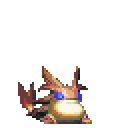
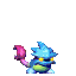

  
  
  
  

<h1 align="center">Alchemy</h1>

<strong>Golden Sun 25th Anniversary Preservation Project</strong>

Alchemy is an unofficial fan project rebuilding _Golden Sun: The Broken Seal_
(TBS) and _Golden Sun: The Lost Age_ (TLA) for the Game Boy Advance from the ground up, without any of the
original makers' files. It aims to preserve all six Japanese and European editions of
each game as they shipped on the cartridge. The Japanese release is treated as
the original and the others as its translations; English _Golden Sun_ is the
first edition rebuilt in full.

## Status: 51.51% DONE

> Previously reported at 70%. Some assembly progress was retracted after a
> stricter audit. We’re working our way back to 70% with verified recoveries.

## What this is

Alchemy is rebuilding both games from scratch, the way their makers would have
kept them on their own computers: readable program text, retained assembly, and organized pictures, music and text. Each
rebuild is compared against the original cartridge down to the last byte. A
rebuilt edition either matches the real game exactly or it does not count.

**DONE** is how much of the game's program has been recovered that way and
proven to match. The picture above shows it: solid blocks are recovered and
proven, lighter blocks are drafts that are close but not yet exact, and the
rest is still unknown. The Data picture shows the same for graphics, sound and
text.

The project targets twelve editions, six of each game, using shared source
where their behavior matches. English _Golden Sun_ is the first edition rebuilt
byte-for-byte in full, with unresolved code still supplied by assembly. The
other editions pass compilation checks; those are not complete-ROM verification.

This is a preservation and study project — not a remake, a mod, an emulator
or a download of the game. You need your own approved ROMs to build it;
nothing here comes from Camelot’s own development files. To build it yourself or help
with the reconstruction, see [CONTRIBUTING.md](CONTRIBUTING.md).

## Acknowledgements

_Golden Sun_, its characters, music, art, and original code were created by
Camelot Software Planning and published by Nintendo. Alchemy is an independent
fan preservation project and is not affiliated with or endorsed by either
company.

Thank you to everyone documenting the Game Boy Advance, improving preservation
tooling, testing reconstructed editions, and contributing careful clean-room
work to Alchemy.

Thank you to the [r/GoldenSun community](https://www.reddit.com/r/GoldenSun/)
for sharing Alchemy, cheering it on, and keeping the love for these games alive.
