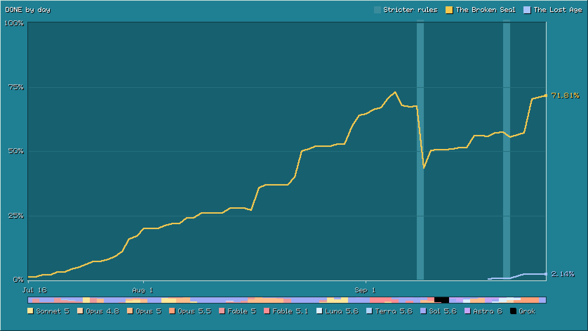
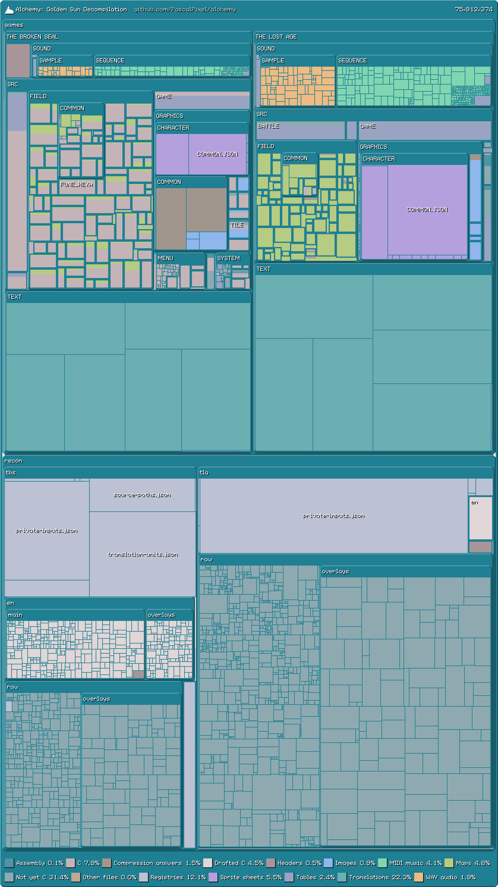

## ⛰️ Alchemy

# Golden Sun Decompilation

In Golden Sun, lighting the four Elemental Lighthouses releases Alchemy upon
the world. This project hopes to do something similar for the games
themselves: to bring **The Broken Seal** ☀️ and **The Lost Age** ⚓️ back to a
form that fans can read, change and build on.

## Why Alchemy?

When Camelot made Golden Sun, they wrote it as human-readable instructions
and then turned those into the unreadable code that sits on the cartridge.
Those original instructions were never released.

Alchemy works backwards. Piece by piece, it rewrites the game in readable form,
and every piece is checked against the original until the two are identical.
The result isn't a guess at how Golden Sun works: it is Golden Sun, in a form
people can finally read. We also try to make it look the way Camelot's own
work might have looked in 2001, down to names taken from the Japanese release:
Sukureta for Kraden, Gerald for Garet.

Once a game can be read, it can be changed. That opens the door to things fans
have wanted for years: Golden Sun running natively on PC, phones and modern
consoles, widescreen and smoother frame rates, quality-of-life fixes, new
translations, and new storylines, quests and Djinn. Alchemy doesn't do these
things itself; it lays the foundation that makes them possible.

Alchemy is not a remake, a mod, an emulator or a download of the games. It
doesn't include the games themselves; you'll need your own copies. For now,
the best way to help is to share the project and cheer it on. It will open to
outside contributions once both games are complete, and developers can find
the technical details in [AGENTS.md](AGENTS.md).

## Progress

**☀️ 68.10% · ⚓️ 2.13%**

The chart shows how far each game has come, day by day: The Broken Seal in
gold, The Lost Age in blue. The two dips mark days the rules for what counts
got stricter, not lost work. The Broken Seal is well past halfway. The Lost Age has only just begun, but it is built much like the first
game, which gives it a head start.

## Acknowledgements

_Golden Sun_, its characters, music, art and original code were created by
Camelot Software Planning and published by Nintendo. Alchemy is an unofficial
fan project and is not affiliated with or endorsed by either company.

Thank you to:

- The [r/GoldenSun community](https://www.reddit.com/r/GoldenSun/), for sharing
  Alchemy, cheering it on, and keeping the love for these games alive.
- Tarpman and Karathan, for identifying the compiler and flags Camelot used.
- Coaltergeist, for [camelot-gcc](https://github.com/Coaltergeist/camelot-gcc),
  the compiler Alchemy first built with.
- [pret](https://github.com/pret), whose decompilations set the standard Alchemy
  measures itself against, and whose [agbcc](https://github.com/pret/agbcc)
  Alchemy builds the games' library code with.
- Brankale and Pokefan531, for the
  [Handheld Color Space Project](https://github.com/Brankale/Handheld-Color-Space-Project),
  whose screen measurements drive the map viewer's GBA, GBA SP and Game Boy
  Micro colour filters.
