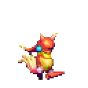

  
  
  
  

<h1 align="center">Alchemy</h1>

<strong>Golden Sun 25th Anniversary Preservation Project</strong>

Alchemy is an unofficial clean-room reconstruction of _Golden Sun_ and
_Golden Sun: The Lost Age_ for the Game Boy Advance. It preserves all six
Japanese and European-language editions of each game from the original
cartridges, with Japanese as the canonical source base and the English
_Golden Sun_ release as the first complete derived build target.

## Status: 52% DONE

## Details

Alchemy rebuilds the games from readable source code, retained assembly, and
named assets while checking the result byte for byte against an approved
cartridge image. The historical editions remain independent from the future
`games/alchemy/` reintegration, so new work cannot weaken their preservation
evidence.

The repository contains one shared source tree per game rather than a copy for
every language. `make targets` checks all twelve edition routes; `make verify`
is the authoritative full-ROM gate for the current `gs1-en` target. Progress
is measured by reconstructed bytes, and retained assembly counts as finished
only when its permanent need is documented and its output is byte-identical.

This is a preservation and decompilation project—not a remake, ROM hack,
emulator, or game distribution. No ROM is included. To build locally or help
with the reconstruction, see [CONTRIBUTING.md](CONTRIBUTING.md), including its
[complete tooling index](CONTRIBUTING.md#tooling-index).

## Acknowledgements

_Golden Sun_, its characters, music, art, and original code were created by
Camelot Software Planning and published by Nintendo. Alchemy is an independent
fan preservation project and is not affiliated with or endorsed by either
company.

Thank you to everyone documenting the Game Boy Advance, improving preservation
tooling, testing reconstructed editions, and contributing careful clean-room
work to Alchemy.
